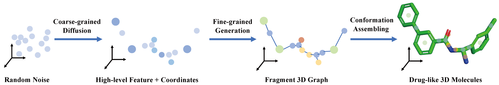

# Coarse-to-Fine: a Hierarchical Diffusion Model for Molecule Generation in 3D


[](https://github.com/qiangbo1222/HierDiff/blob/main/LICENSE)

The official implementation of 'Coarse-to-Fine: a Hierarchical Diffusion Model for Molecule Generation in 3D' (ICML 2023 Poster). This is our first public release version, so feel free to open an issue if you meet trouble applying our code.

[Code](https://github.com/qiangbo1222/HierDiff)   [Paper Arxiv](https://arxiv.org/abs/2305.13266)



## Environments

### Install via Conda (Recommended)

```bash
# Clone the environment
conda env create -f environment.yaml
# Activate the environment
conda activate hierdiff
```

## Dataset
The instruction for preprocessing the dataset are provided in `data/readme.md`.


## Training
You can train the model with the following commands:

```bash
# train the coarse-grained diffusion model
cd endiffusion
python train.py
# train refine model and fine-grained generative model
cd ..
python train_edge_denoise_pl.py
python train_refine_pl.py
```

## Generation
You can used HierDiff to sample molecules, there are mainly three steps to generate drug-like molecules in 3D space.

Firstly, change the checkpoint variable in `endiffusion/conf/sample.yaml` to your trained checkpoint path. then run :
```bash
# Sample coarse-grained fragment pointset
cd endiffusion
python sampler.py
```

Then changed the ckpt variables in `conf/generation/edge_denoise.yaml` to the pretrained edge_denoise ckpt and refine ckpt and run: 

```bash
# Sample fine-grained fragment 3D graph
INPUT_PATH='YOUR PICKLED COARSED-GRAINED SAMPLES'
OUTPUT_PATH='PATH TO SAVE FINE-GRAINED FRGAMENTS GRAPH'
python generation/ar_sampling_nosize.py --input_path $INPUT_PATH --output_path $OUTPUT_PATH
```

At last, you need to reconstruct the molecules from the fragment graphs:

```bash
# Sample fine-grained fragment 3D graph
RESULT_PATH='PATH TO SAVE FINAL RESULTS'
python generation/reconstruct.py --tree_path $OUTPUT_PATH --output_dir $RESULT_PATH
```

The output files is a pickled file containing the coordinates of the fragment centers and Rdkit Mol object. If you need atom-resolution coordinates, you can pass the results to the *set_rmsd* function from `eval/MFF_RMSD.py` to derive refined conformations.

## Citation
Please consider citing the our paper if you find it helpful. Thank you!
```
@inproceedings{qiang2023coarse,
  title={Coarse-to-Fine: a Hierarchical Diffusion Model for Molecule Generation in 3D},
  author={Qiang, Bo and Song, Yuxuan and Xu, Minkai and Gong, Jingjing and Gao, Bowen and Zhou, Hao and Ma, Wei-Ying and Lan, Yanyan},
  booktitle={International Conference on Machine Learning},
  pages={28277--28299},
  year={2023},
  organization={PMLR}
}
```
This Code is build upon [JT-VAE](https://github.com/wengong-jin/icml18-jtnn) and [EDM](https://github.com/ehoogeboom/e3_diffusion_for_molecules). We would like to acknowledge their contribution.